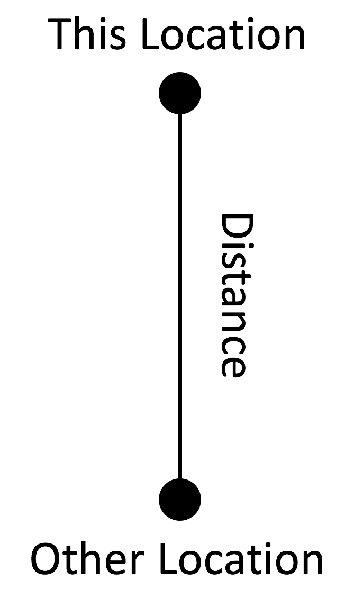
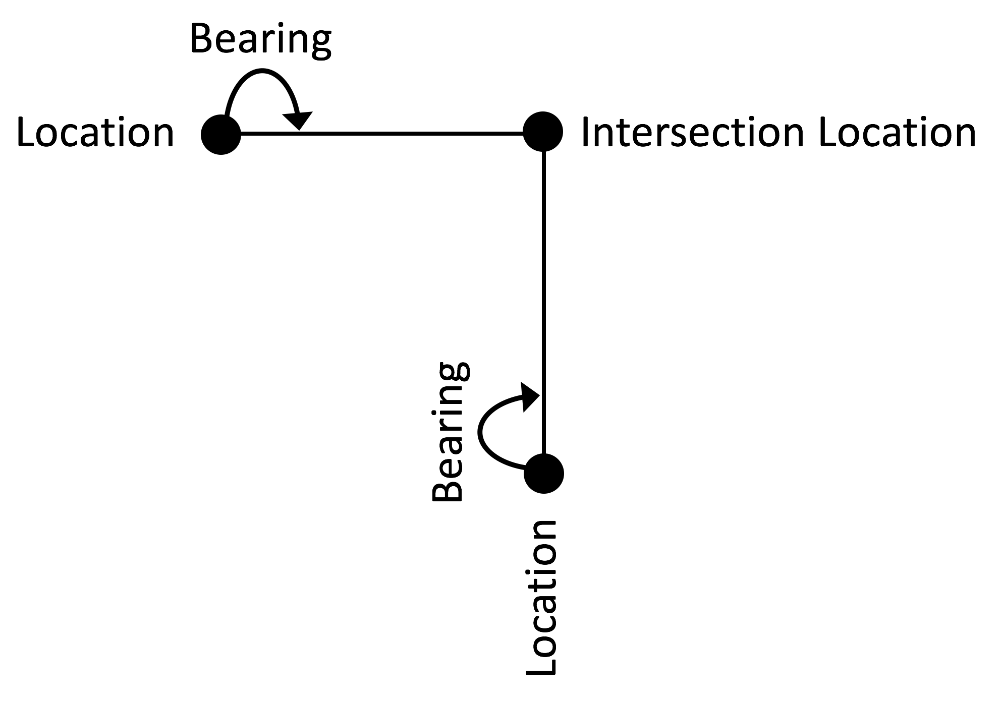
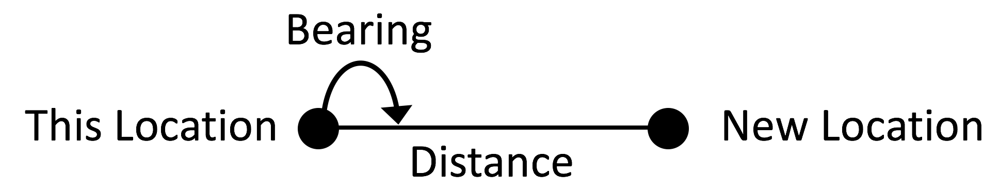
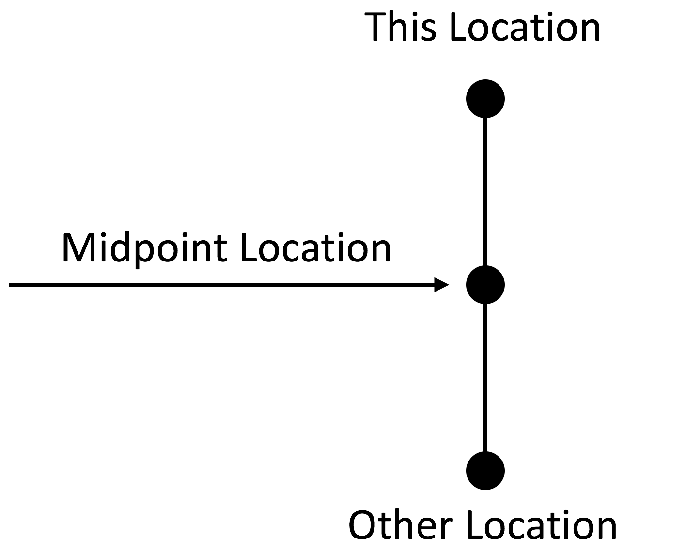

# GreatCircle [](https://raw.githubusercontent.com/softwarenerd/GreatCircle/master/LICENSE.md) [](https://github.com/softwarenerd/GreatCircle/releases) [](https://travis-ci.org/softwarenerd/GreatCircle) [](https://github.com/Carthage/Carthage) [](https://cocoapods.org/pods/GreatCircle)

GreatCircle is an iOS framework that provides a set of extensions to the `CLLocation` class.

#### The Problem

The CLLocation class provides only one method: 

``- (CLLocationDistance)distanceFromLocation:(const CLLocation *)location``

For calculating the distance between two GPS locations. Because of this, iOS developers must "roll their own" to solve more complex GPS location calculation 
problems.

#### The Solution

[GreatCircle](https://github.com/softwarenerd/GreatCircle) - which is based on the amazing work of [Chris Veness](https://github.com/chrisveness), the owner 
of the [Geodesy functions](https://github.com/chrisveness/geodesy) project - provides a comprehensive set of extension methods to the `CLLocation` class that
make working with GPS locations and performing calculations on then simple and easy.

(For a more general introduction, see: [Movable Type Scripts Latitude / Longitude Calculations Reference](http://www.movable-type.co.uk/scripts/latlong.html))

#### Status

Thus far, I have worked on porting the spherical-earth model, which provides simple formulae covering the accuracy requirements of most use cases.

## Quick Links

- [Getting Started](#getting-started)
- [Documentation](#documentation)
- [Code of Conduct](CODE_OF_CONDUCT.md)
- [Contributing](#contributing)
- [License](#license)

## Getting Started

GreatCircle can be used via [Carthage dependency manager](https://github.com/Carthage/Carthage) or as a [CocoaPod](https://cocoapods.org/pods/GreatCircle).

### Carthage

There are excellent [Instructions](https://github.com/Carthage/Carthage#getting-started) available on the [Carthage](https://github.com/Carthage/Carthage) site, which are summarized below.

#### Add GreatCircle to your Cartfile

```github "softwarenerd/GreatCircle"```

#### Update Carthage

```carthage update```

#### Add GreatCircle.framework to Linked Frameworks and Libraries

On your application targets’ “General” settings tab, in the “Linked Frameworks and Libraries” section, drag and drop GreatCircle.framework the Carthage/Build/iOS folder on disk.


#### Add Copy Frameworks Run Script

On your application targets’ “Build Phases” settings tab, click the “+” icon and choose “New Run Script Phase”. Create a Run Script in which you specify your shell (ex: `bin/sh`), add the following contents to the script area below the shell:

 ```sh
  /usr/local/bin/carthage copy-frameworks
  ```

  and add the paths to the frameworks you want to use under “Input Files”, e.g.:

  ```
  $(SRCROOT)/Carthage/Build/iOS/GreatCircle.framework
  ```
  
  

### CocoaPod

Add `GreatCircle` to your podfile:
```
platform :ios, '10.0'
use_frameworks!
target 'YourTarget'
pod 'GreatCircle', '~> 1.0.0'
```

And install it using:
```
pod install
```

If this is the first time you've used a CocoaPod in your project, you will need to switch from your ProjectName.xcodeproj file to the ProjectName.xcworkspace that was created by the `pod install` command.

## Documentation

### Import GreatCircle

Import the GreatCircle framework into your source file(s) as needed.

*Extension Methods*

**`-crossTrackDistanceToStartLocation:endLocation:`**   
Returns the cross track distance (in meters) of this location relative to the specified start location and end location.

**`-crossTrackLocationToStartLocation:endLocation:`**   
Returns a location representing the cross track point of this location relative to the specified start location and end location.


**`-distanceToOtherLocation:`**   
Returns the distance (in meters) between this location and the other location.



**`-finalBearingToOtherLocation:`**   
Returns the final bearing (in degrees) between this location and the other location. The final bearing is the initial bearing from 
the other location to this location reversed 180°. The final bearing will differ from the initial bearing by varying degrees according 
to distance and latitude.

**`-initialBearingToOtherLocation:`**   
Returns the initial bearing (in degrees) between this location and the other location.

**`+intersectionOfLocation:andBearing:withLocation:andBearing:`**   
Returns a location representing the point of intersection of two paths, each specified by a location and bearing. Returns nil if 
the two paths do not cross.



**`-isEqualToOtherLocation:`**   
Compares this location to the other location for equality.

**`-locationWithBearing:distance:`**   
Returns a location representing the point that lies at the specified bearing and distance from this location.



**`-midpointToOtherLocation:`**   
Returns a location representing the midpoint between this location and the other location.



## Contributing

GreatCircle is a work in progress and your contributions are most welcome. Feel free to fork the repo and submit PR's.

## License

GreatCircle is released under the [MIT License](LICENSE.md).
