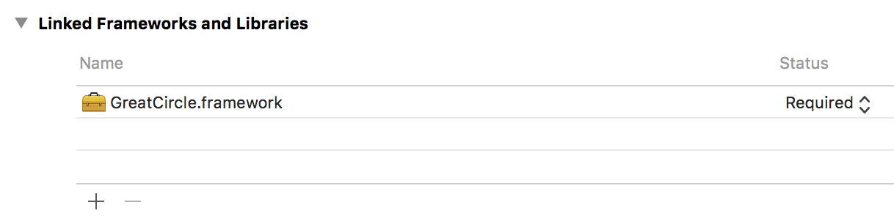
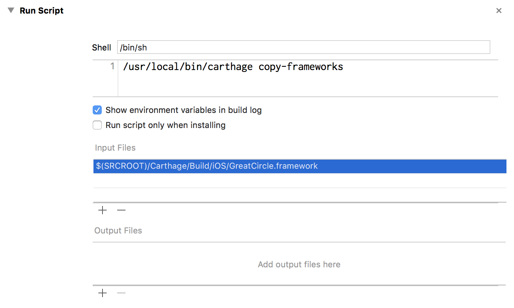
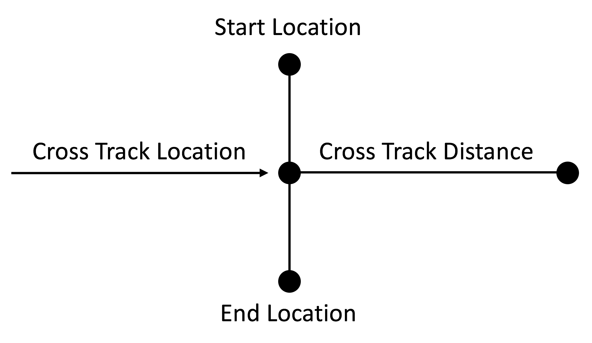

# GreatCircle

GreatCircle is an iOS framework that provides a set of extensions to the `CLLocation` class.

#### The Problem

The CLLocation class provides only one method: 

``- (CLLocationDistance)distanceFromLocation:(const CLLocation *)location``

For calculating the distance between two GPS locations. Because of this, iOS developers must "roll their own" to solve more complex GPS location calculation 
problems.

#### The Solution

[GreatCircle](https://github.com/softwarenerd/GreatCircle) - which is based on the amazing work of [Chris Veness](https://github.com/chrisveness), the owner 
of the [Geodesy functions](https://github.com/chrisveness/geodesy) project - provides a comprehensive set of extension methods to the `CLLocation` class that
make working with GPS locations and performing calculations on then simple and easy.

(For a more general introduction, see: [Movable Type Scripts Latitude / Longitude Calculations Reference](http://www.movable-type.co.uk/scripts/latlong.html))

#### Status

Thus far, I have worked on porting the spherical-earth model, which provides simple formulae covering the accuracy requirements of most use cases.

## Quick Links

- [Getting Started](#getting-started)
- [Documentation](#documentation)
- [Code of Conduct](CODE_OF_CONDUCT.md)
- [Contributing](#contributing)
- [License](#license)

## Getting Started

GreatCircle should be used via [Carthage dependency manager](https://github.com/Carthage/Carthage). (Why no Cocoapod? I've switched my work to Carthage. [Here's why.](https://github.com/Carthage/Carthage#differences-between-carthage-and-cocoapods))

#### Add GreatCircle to your Cartfile

```github "softwarenerd/GreatCircle" "master"```

(Until GreatCircle is released, there are no tagged versions, so please use the ```master``` branch.)

#### Update Carthage

```carthage update```

#### Add GreatCircle.framework to Linked Frameworks and Libraries



#### Add Copy Frameworks Run Script

Add a run script that uses the ```carthage copy-frameworks``` command to copy the ```GreatCircle.framework``` 



## Documentation

*Extension Methods*

`-crossTrackDistanceToStartLocation:endLocation:`   
- Returns the cross track distance of this location relative to the specified start location and end location.

`-crossTrackLocationToStartLocation:endLocation:`   
- Returns a location representing the cross track point of this location relative to the specified start location and end location.



    * `-distanceToOtherLocation:`
        - Returns the distance (in meters) between this location and the other location.

    * `-finalBearingToOtherLocation:`
        - Returns the final bearing (in degrees) between this location and the other location.

    * `-initialBearingToOtherLocation:`
        - Returns the initial bearing (in degrees) between this location and the other location.

    * `+intersectionOfLocation:andBearing:withLocation:andBearing:`
        - Returns a location representing the point of intersection of two paths, each specified by a location and bearing.

    * `-isEqualToOtherLocation:`
        - Compares this location to the other location for equality.

    * `-locationWithBearing:distance:`
        - Returns a location representing the point that lies at the specified bearing and distance from this location.

    * `-midpointToOtherLocation:`
        - Returns a location representing the midpoint between this location and the other location.

## Contributing

GreatCircle is a work in progress and your contributions are most welcome. Feel free to fork the repo and submit PR's.

## License

GreatCircle is released under the [MIT License](LICENSE.md).